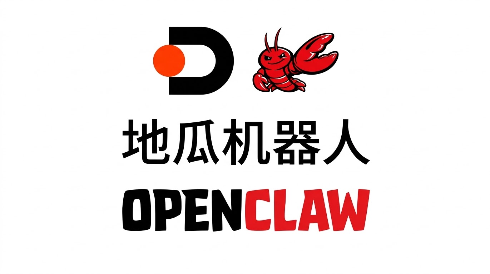

# 🦞地瓜 RDK-OpenClaw 完整部署教程

<p align="center">
  
</p>

> **适用人群**：零基础新手 / Linux 初学者  
> **部署环境**：D-Robotics RDK S100（ARM aarch64）+ Ubuntu 22.04  
> **部署方式**：原生脚本安装（非 Docker）  
> **作者实测时间**：2026 年 2 月 22 日  
> **OpenClaw 版本**：v2026.3.2

---

## 📖 目录

- [一、什么是 OpenClaw？](#一什么是-openclaw)
- [二、为什么选择 ARM 开发板？](#二为什么选择-arm-开发板)
- [三、系统环境诊断（部署前必做）](#三系统环境诊断部署前必做)
- [四、部署前准备](#四部署前准备)
  - [4.1 配置 Swap 虚拟内存](#41-配置-swap-虚拟内存)
  - [4.2 安装 Node.js 22](#42-安装-nodejs-22)
  - [4.3 安装其他依赖](#43-安装其他依赖)
- [五、安装 OpenClaw](#五安装-openclaw)
  - [5.1 运行官方安装脚本](#51-运行官方安装脚本)
  - [5.2 配置环境变量](#52-配置环境变量)
  - [5.3 初始化与注册系统服务](#53-初始化与注册系统服务)
- [六、验证部署](#六验证部署)
- [七、安全加固指南](#七安全加固指南)
- [八、常见问题排查（FAQ）](#八常见问题排查faq)
- [九、附录：辅助脚本](#九附录辅助脚本)

---

## 一、什么是 OpenClaw？

OpenClaw 是一个**开源的自主 AI 代理平台**，由 Peter Steinberger 开发，于 2025 年底首次发布。它的核心理念是让你在**自己的设备上**运行一个功能强大的 AI 助手，而不需要依赖云端服务。

### 核心能力

| 能力 | 说明 |
|------|------|
| 💬 多平台消息 | 连接 WhatsApp、Telegram、Discord、Signal、iMessage |
| 🖥️ 系统操作 | 执行 Shell 命令、文件管理、浏览器自动化 |
| 🧠 持久记忆 | 保存对话上下文和用户偏好 |
| 🔧 可扩展 | 100+ 预配置 AgentSkills，支持自定义技能 |
| 🤖 模型自由 | 支持 Claude、GPT、Gemini，也可以通过 Ollama 使用本地模型 |

### 与云端 AI 的区别

- **隐私**：所有数据存储在你自己的设备上
- **永远在线**：作为系统守护进程 24/7 运行
- **主动通知**：可以主动给你发送消息（如定时提醒、邮件摘要）
- **完全控制**：你决定它能做什么、不能做什么

---

## 二、为什么选择 ARM 开发板？

ARM 开发板（如 D-Robotics RDK S100、树莓派 5 等）非常适合部署 OpenClaw：

- ⚡ **功耗低**：全天候运行也不会贡献可观的电费
- 🔇 **静音**：无风扇设计，放在桌面上毫无存在感
- 💰 **成本低**：几百到一千元就能搞定
- 🏠 **本地化**：数据不出家门，保护隐私

### 硬件最低要求

| 项目 | 最低要求 | 推荐配置 |
|------|----------|----------|
| CPU | ARM64 / x86_64 | 4+ 核心 |
| 内存 | 2 GB（纯云端 API） | 4 GB+ |
| 存储 | 20 GB 可用空间 | 50 GB+ SSD |
| 系统 | Ubuntu 22.04+ / Debian 12+ | Ubuntu 22.04 LTS |
| 网络 | 可联网（API 调用） | 有线网络优先 |

> ⚠️ **注意**：如果你想在本地运行 LLM（如 Llama），至少需要 16 GB 内存和支持 CUDA 的 GPU。只使用云端 API（如 Claude/GPT）则不需要 GPU。

---

## 三、系统环境诊断（部署前必做）

在开始安装之前，我们需要了解设备的"体检报告"。这一步非常重要，可以帮你提前发现问题。

### 3.1 运行诊断命令

逐条运行以下命令，记录输出：

```bash
# 查看操作系统版本
cat /etc/os-release

# 查看 CPU 架构
uname -m
# 预期输出：aarch64（ARM 64 位）或 x86_64

# 查看 CPU 详情
lscpu | head -15

# 查看内存
free -h

# 查看磁盘
df -h /

# 检查是否有 Swap
swapon --show
# 如果没有输出，说明没有配置 Swap

# 检查 Docker（可选）
docker --version

# 检查 Node.js（关键！）
node --version
# 如果提示 command not found，需要安装

# 检查 Python
python3 --version

# 检查 Git
git --version

# 检查端口 18789 是否空闲
ss -tlnp | grep 18789 || echo "端口空闲 ✓"
```

> 💡 **偷懒方法**：本教程附带了一个一键诊断脚本 `openclaw_check.sh`，可以自动检测所有项目。详见 [附录](#九附录辅助脚本)。

### 3.2 我的实际诊断结果（供参考）

以下是我在 D-Robotics RDK S100 上的真实诊断输出：

```
=== OS Info ===
PRETTY_NAME="Ubuntu 22.04.5 LTS"
VERSION_ID="22.04"

=== Kernel ===
Linux ubuntu 6.1.112-rt43 aarch64

=== CPU ===
Architecture:          aarch64
CPU(s):                6
Model name:            Cortex-A78AE
CPU max MHz:           1500.0000

=== Memory ===
               total        used        free      shared  buff/cache   available
Mem:           9.3Gi       5.3Gi       1.1Gi        58Mi       2.9Gi       3.9Gi
Swap:             0B          0B          0B     ← 没有 Swap！需要配置

=== Disk ===
Filesystem       Size  Used Avail Use% Mounted on
/dev/mmcblk0p17   45G   18G   26G  41% /

=== Node.js ===
Node.js not installed                  ← 需要安装！

=== Python ===
Python 3.10.12                         ← OK

=== Git ===
git version 2.34.1                     ← OK
```

### 3.3 诊断结论

根据诊断结果，我需要在安装前完成以下准备工作：

| 检查项 | 状态 | 需要操作 |
|--------|------|----------|
| 操作系统 | ✅ Ubuntu 22.04 | 无 |
| CPU 架构 | ✅ aarch64 支持 | 无 |
| 内存 | ⚠️ 可用 3.9 GB | 需要配置 Swap |
| Swap | ❌ 未配置 | **必须添加 4 GB Swap** |
| 磁盘 | ⚠️ 26 GB 可用 | 够用，但余量不大 |
| Node.js | ❌ 未安装 | **必须安装 v22+** |
| Python | ✅ 3.10 | 无 |
| Git | ✅ 已安装 | 无 |
| 端口 18789 | ✅ 空闲 | 无 |

> 📝 **特别提醒**：如果你的设备已经运行了其他服务（比如我的设备上有 Coze Studio 的 9 个 Docker 容器占用了 5.3 GB 内存），需要特别关注内存是否充足。

---

## 四、部署前准备

### 4.1 配置 Swap 虚拟内存

**为什么需要 Swap？**

Swap 是磁盘上的虚拟内存空间。当物理内存不够用时，系统会把一部分数据暂时放到 Swap 里。OpenClaw 在安装阶段（npm 构建）可能需要较多内存，配置 Swap 可以防止 OOM（内存溢出）导致安装失败。

```bash
# 创建 4GB 的交换文件
sudo fallocate -l 4G /swapfile

# 设置权限（只有 root 能读写）
sudo chmod 600 /swapfile

# 格式化为交换空间
sudo mkswap /swapfile

# 立即启用
sudo swapon /swapfile

# 设置开机自动挂载（持久化）
echo '/swapfile none swap sw 0 0' | sudo tee -a /etc/fstab
```

**验证**：

```bash
swapon --show
```

预期输出：

```
NAME      TYPE SIZE USED PRIO
/swapfile file   4G   0B   -2
```

实际运行日志：

```
Setting up swapspace version 1, size = 4 GiB (4294901760 bytes)
no label, UUID=c8196428-ba1e-4aff-9483-b18f99dfc62e
/swapfile none swap sw 0 0
=== Swap configured ===
NAME      TYPE SIZE USED PRIO
/swapfile file   4G   0B   -2
               total        used        free      shared  buff/cache   available
Mem:           9.3Gi       5.3Gi       1.0Gi        58Mi       3.0Gi       3.3Gi
Swap:          4.0Gi          0B       4.0Gi          ← 成功！
```

### 4.2 安装 Node.js 22

OpenClaw 要求 **Node.js 22 或更高版本**。Ubuntu 22.04 默认源里没有这么新的版本，我们需要使用 NodeSource 官方源。

```bash
# 添加 NodeSource 22.x 源
curl -fsSL https://deb.nodesource.com/setup_22.x | sudo -E bash -

# 安装 Node.js
sudo apt-get install -y nodejs
```

**验证**：

```bash
node --version
npm --version
```

实际运行日志（关键部分）：

```
2026-03-06 09:28:53 - Repository configured successfully.
2026-03-06 09:28:53 - To install Node.js, run: apt install nodejs -y

...

Selecting previously unselected package nodejs.
Unpacking nodejs (22.22.1-1nodesource1) ...
Setting up nodejs (22.22.1-1nodesource1) ...
```

验证输出：

```
$ node --version
v22.22.1             ← 完美！

$ npm --version
10.9.4
```

### 4.3 安装其他依赖

```bash
# python3-venv 用于 OpenClaw 的某些技能（Skill）
sudo apt-get install -y python3-venv python3-pip curl wget
```

> 💡 如果系统提示 `python3-venv is already the newest version`，说明已经安装了，无需重复操作。

---

## 五、安装 OpenClaw

### 5.1 运行官方安装脚本

这是最简单的安装方式，一条命令搞定：

```bash
curl -fsSL https://openclaw.ai/install.sh | bash
```

实际运行日志：

```
  🦞 OpenClaw Installer
  Your AI assistant, now without the $3,499 headset.

✓ Detected: linux

Install plan
OS: linux
Install method: npm
Requested version: latest

[1/3] Preparing environment
✓ Node.js v22.22.1 found
· Active Node.js: v22.22.1 (/usr/bin/node)
· Active npm: 10.9.4 (/usr/bin/npm)

[2/3] Installing OpenClaw
✓ Git already installed
· Configuring npm for user-local installs
✓ npm configured for user installs
· Installing OpenClaw v2026.3.2
✓ OpenClaw npm package installed
✓ OpenClaw installed

[3/3] Finalizing setup

! PATH missing npm global bin dir: /home/sunrise/.npm-global/bin   ← 注意这个警告！
  This can make openclaw show as "command not found" in new terminals.
  Fix (zsh: ~/.zshrc, bash: ~/.bashrc):
    export PATH="/home/sunrise/.npm-global/bin:$PATH"

🦞 OpenClaw installed successfully (2026.3.2)!
```

安装过程大约需要 **2-5 分钟**（取决于网络速度）。

### 5.2 配置环境变量

安装完成后你可能会看到一个 PATH 相关的警告。如果不配置，新打开的终端会找不到 `openclaw` 命令。

```bash
# 将 npm 全局安装路径加入 PATH（根据你的 shell 选择文件）
# bash 用户：
echo 'export PATH="$HOME/.npm-global/bin:$PATH"' >> ~/.bashrc
source ~/.bashrc

# zsh 用户：
echo 'export PATH="$HOME/.npm-global/bin:$PATH"' >> ~/.zshrc
source ~/.zshrc
```

**验证**：

```bash
which openclaw
openclaw --version
```

预期输出：

```
/home/sunrise/.npm-global/bin/openclaw
2026.3.2
```

> ⚠️ **新手常见坑**：如果执行 `openclaw` 提示 `command not found`（错误码 127），99% 是因为没有执行上面的 `source ~/.bashrc`，或者当前终端没有刷新环境变量。**请重新打开一个终端窗口再试**。

### 5.3 初始化与注册系统服务

这是最后一步，也是最重要的一步。`onboard` 向导会引导你完成所有初始配置：

```bash
openclaw onboard --install-daemon
```

向导会依次询问你以下内容：

#### 选择 LLM 提供商

```
? Select your LLM provider:
  ❯ Anthropic (Claude)
    OpenAI (GPT)
    Google (Gemini)
    Ollama (Local)
```

**推荐选择 Anthropic Claude 或 OpenAI GPT**。如果你没有 API Key，可以前往以下网站申请：

| 提供商 | 注册地址 | 价格 |
|--------|----------|------|
| Anthropic | https://console.anthropic.com | 按量计费，约 $3/百万 token |
| OpenAI | https://platform.openai.com | 按量计费，约 $2.5/百万 token |
| Google | https://aistudio.google.com | 有免费额度 |

#### 输入 API Key

```
? Enter your API key: sk-ant-xxxxxxxxxxxxx
```

复制粘贴你的 API Key 即可。

#### 配置消息通道（可选）

你可以选择连接一个或多个消息平台：

- **Telegram**：需要在 @BotFather 创建 Bot，获取 API Token
- **Discord**：需要创建 Application，添加 Bot，获取 Token
- **WhatsApp**：通过 WhatsApp Web 扫码绑定

> 💡 初次使用建议先配置 Telegram，因为设置最简单。后续可以随时添加更多通道。

#### `--install-daemon` 参数说明

加上这个参数，OpenClaw 会自动注册为 **systemd 系统服务**，开机自启动：

```bash
# 查看服务状态
systemctl status openclaw

# 手动停止/启动
sudo systemctl stop openclaw
sudo systemctl start openclaw

# 查看日志
journalctl -u openclaw -f
```

---

## 六、验证部署

安装完成后，运行以下命令确认一切正常：

```bash
# 1. 检查 Gateway 状态
openclaw gateway status

# 2. 运行自带诊断工具
openclaw doctor

# 3. 检查系统服务（如果使用了 --install-daemon）
systemctl status openclaw

# 4. 访问控制面板
# 在浏览器中打开：http://127.0.0.1:18789/
```

如果 `openclaw doctor` 报告所有项目都是 ✅，恭喜你，OpenClaw 已经成功部署！

### 远程访问控制面板

如果你的开发板没有显示器，可以通过 SSH 隧道从你的电脑上访问：

```bash
# 在你的电脑上执行（替换为开发板的 IP）
ssh -L 18789:127.0.0.1:18789 sunrise@192.168.6.195

# 然后在浏览器打开 http://127.0.0.1:18789/
```

---

## 七、安全加固指南

OpenClaw 虽然功能强大，但因为它拥有系统级的操作权限，安全配置非常重要。

### 7.1 端口安全

```bash
# ❌ 危险！不要这样做：
sudo ufw allow 18789    # 不要对外暴露控制面板端口！

# ✅ 正确做法：通过 SSH 隧道访问（见上一节）
# 或者使用 Tailscale 进行安全的远程访问
```

### 7.2 API Key 保护

```bash
# 确保凭据文件权限正确
chmod 700 ~/.openclaw/credentials.enc

# 定期轮换 API Key
```

### 7.3 沙箱模式

在 OpenClaw 配置中启用文件操作沙箱，限制 AI 可以操作的目录范围：

```bash
# 编辑配置文件
nano ~/.openclaw/workspace/config.yaml

# 建议启用以下设置：
# sandbox_mode: true
# allowed_directories:
#   - ~/Documents
#   - ~/Downloads
```

### 7.4 权限最小化

- **不要给 OpenClaw sudo 权限**，除非你完全清楚后果
- 只批准你认识的用户通过消息通道连接
- 安装第三方技能（Skill）前，先审查其源代码

---

## 八、常见问题排查（FAQ）

### Q1: `openclaw: command not found`

**原因**：PATH 环境变量未正确配置。  
**解决**：

```bash
# 临时修复（当前终端立即生效）
export PATH="$HOME/.npm-global/bin:$PATH"

# 永久修复
echo 'export PATH="$HOME/.npm-global/bin:$PATH"' >> ~/.bashrc
source ~/.bashrc
```

### Q2: 安装时 npm 报内存不足

**原因**：物理内存不够，没有配置 Swap。  
**解决**：按照 [4.1 节](#41-配置-swap-虚拟内存) 配置 4 GB Swap 后重新安装。

### Q3: Node.js 版本不满足要求

**原因**：通过 `apt install nodejs` 安装的默认版本太低。  
**解决**：使用 NodeSource 源安装 v22+，见 [4.2 节](#42-安装-nodejs-22)。

### Q4: 端口 18789 被占用

**原因**：有其他服务使用了这个端口。  
**解决**：

```bash
# 查看占用端口的进程
sudo ss -tlnp | grep 18789

# 停止占用的进程，或者修改 OpenClaw 配置使用其他端口
```

### Q5: Coze Studio 等其他服务和 OpenClaw 共存

如果你的设备已经运行了其他 Docker 服务（如 Coze Studio），需要注意内存是否够用：

```bash
# 查看 Docker 容器资源占用
docker stats --no-stream

# 查看系统总体内存
free -h
```

如果内存不足，可以考虑：
- 停止不常用的容器：`docker stop <容器名>`
- 增加 Swap 大小
- 使用更轻量的 LLM 模型

### Q6: `openclaw onboard` 报错退出

**原因**：需要在交互式终端中运行（SSH、本地终端等），不能在非 tty 环境中运行。  
**解决**：通过 SSH 登录到设备后执行，或直接在设备终端上运行。

---

## 九、附录：辅助脚本

### 脚本 1：一键系统诊断（`openclaw_check.sh`）

部署前运行此脚本，快速了解设备是否满足 OpenClaw 的安装要求：

```bash
# 运行方式
chmod +x openclaw_check.sh
./openclaw_check.sh
```

脚本文件随本教程一起提供，详见 `openclaw_check.sh`。

### 脚本 2：一键安装前置依赖（`openclaw_prepare.sh`）

自动完成 Swap 配置 + Node.js 安装 + 依赖安装：

```bash
# 运行方式
chmod +x openclaw_prepare.sh
sudo ./openclaw_prepare.sh
```

脚本文件随本教程一起提供，详见 `openclaw_prepare.sh`。

---

## 🎉 恭喜完成部署！

如果你按照教程完成了所有步骤，现在你应该拥有了一个运行在自己设备上的 AI 助手。你可以：

- 📱 通过 Telegram/Discord 和它对话
- 🌐 通过控制面板 (http://127.0.0.1:18789/) 管理它
- 🛠️ 安装更多 Skill 扩展它的能力
- 📝 编辑 `~/.openclaw/workspace/SOUL.md` 自定义它的性格

如果遇到问题，欢迎和我交流讨论！

